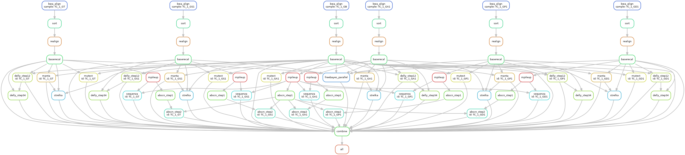

# snakepipe2
Snakeake pipeline starting from `fastq.gz` to variant calling. 

# Setting up the folders and configuration
snakefile이 있는 폴더에 `dna_fastq`라는 폴더를 만들어서 `fastq.gz`  파일들을 옮긴다. 이때 파일을 소프트링크를 해도 괜찮음. 단 중요한 점은 `fastq.gz`파일들이 이름을 통일시켜주어야 한다. 예를 들어 `sample1_R1.fastq.gz`와 `sample1_R2.fastq.gz` 파일을 예로 들면, `fastq.gz`파일들은 반드시 `_R1.fastq.gz`와 `_R2.fastq.gz` 의 형태를 가져야하며, 향후 만들어지는 `bam`파일은 `dna_bam/sample1.bam`이 되며 header에 `@RG\tSM:sample1`을 갖게 된다. 

Variant calling 단계에서도 `sample1`이 ID가 되어서 tumor와 normal을 `sampleConfig.yaml`에 지정할때 다음과 같이 지정하게 된다. 

```
$ cat sampleConfig.yaml
id:
    person1:
        tumor: sample1
        normal: sample2
...
```
이 예시에서 person1이라는 사람에게 tumor는 `dna_bam/sample1.bam`을 쓰고, normal은 `dna_bam/sample2.bam`을 사용하여 variant calling을 하게 된다. 

파이프라인에서 사용되는 tool들의PATH는 pathConfig.yaml에 지정되어 있고 사용자에 맞춰서 변경 가능하다. 
일부 스크립트들은 snakefile하위 폴더의 relative path로 지정되어있다. 


# Usage
```
$ snakemake -p -s snakepipe.sm -j 24
```

# Outline


1. `bwa mem` with `samblaster` mark duplicate
2. `GATK3` indel realignment and base recalibration
3. mpileup followed by `sequenza`
4. `manta`
5. `delly`
6. `mutect1`
7. `strelka2`
8. in-house absCN script


